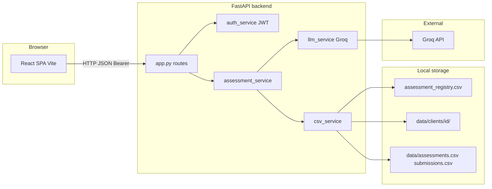

# Architecture: AI Assessment Platform

This document describes the system architecture, major components, data flow, and feature set for the **pyassesment** project: a web application where **administrators** generate Python-focused assessments using an LLM, and **participants** take those assessments in the browser. Persistence is **file-based (CSV)** under `data/`.

## Table of contents

- [1. Purpose and scope](#1-purpose-and-scope)
- [2. High-level architecture](#2-high-level-architecture)
- [3. Technology stack](#3-technology-stack)
- [4. Backend structure](#4-backend-structure)
  - [4.1 Entry point and cross-cutting concerns](#41-entry-point-and-cross-cutting-concerns)
  - [4.2 Authentication and authorization](#42-authentication-and-authorization)
  - [4.3 HTTP API (feature summary)](#43-http-api-feature-summary)
- [5. Service layer](#5-service-layer)
  - [5.1 `services/llm_service.py`](#51-servicesllm_servicepy)
  - [5.2 `services/assessment_service.py`](#52-servicesassessment_servicepy)
  - [5.3 `services/csv_service.py`](#53-servicescsv_servicepy)
- [6. Data model (CSV)](#6-data-model-csv)
- [7. Frontend architecture](#7-frontend-architecture)
  - [7.1 UI features (by page)](#71-ui-features-by-page)
- [8. Configuration reference](#8-configuration-reference)
- [9. Security and operational notes](#9-security-and-operational-notes)
- [10. How to run (reference)](#10-how-to-run-reference)
- [11. Feature checklist (complete)](#11-feature-checklist-complete)

---

## 1. Purpose and scope

| Goal | Description |
|------|-------------|
| Generate assessments | Admin creates assessments by topic, difficulty, question types, and per-type counts; questions are produced by **Groq** (OpenAI-compatible Chat Completions). |
| Serve assessments safely | Participants fetch questions **without** correct answers; access is scoped by **client ID** when the assessment is registry-backed. |
| Grade submissions | Each answer is scored (0–100) and given short feedback via the LLM; **MCQ** correctness can also use stored answers; aggregate scores are returned. |
| Audit & review | Admin can list all assessments and all submission rows (grouped in the UI for readability). |

---

## 2. High-level architecture

- **Single-page application (SPA)** talks to **FastAPI** over HTTP (often `/api` proxied to the backend in development).
- **Business logic** lives in `services/`; **routes and validation** in `app.py`.
- **Groq** is used for question generation and per-answer grading (JSON-mode responses).

---

## 3. Technology stack

| Layer | Technology |
|-------|------------|
| API | Python 3, **FastAPI**, Pydantic v2, Uvicorn |
| Auth | **PyJWT**, HS256, Bearer tokens |
| LLM | **OpenAI Python SDK** with `base_url` pointing at Groq (`https://api.groq.com/openai/v1`) |
| Config | `python-dotenv` (`.env` beside `app.py` and loaded from services) |
| Persistence | UTF-8 **CSV** files |
| Frontend | **React 18**, **React Router 7**, **Vite 6** |

Dependencies are listed in `requirements.txt` (backend) and `frontend/package.json` (frontend).

---

## 4. Backend structure

### 4.1 Entry point and cross-cutting concerns

- **`app.py`**: FastAPI app, CORS (localhost dev ports for Vite and common alternatives), route definitions, Pydantic request bodies, and dependency-injected auth (`HTTPBearer`).
- **Environment**: `.env` is loaded from the project root when the app and `llm_service` start, so keys work regardless of the process working directory.

### 4.2 Authentication and authorization

| Role | Login | Token contents | Protected capabilities |
|------|--------|----------------|------------------------|
| **admin** | Password vs `ADMIN_PASSWORD` | JWT with `role: admin` | Generate assessments, list assessments, list submissions |
| **client** | `client_id` only (sanitized) | JWT with `role: client` and `client_id` | Fetch assessment (if allowed), submit answers |

- **`JWT_SECRET`**: required for signing tokens (client login and admin login both issue JWTs).
- **Admin password**: constant-time compare via `secrets.compare_digest`.
- **Client ID rules**: letters, digits, `_`, `-`, max 64 characters (`csv_service.sanitize_client_id`).

### 4.3 HTTP API (feature summary)

| Method | Path | Auth | Behavior |
|--------|------|------|------------|
| `POST` | `/auth/login` | None | Returns `access_token`, `token_type`, `role`; client response includes normalized `client_id`. |
| `GET` | `/admin/assessments` | Admin | Lists assessments: id, client, question count, source (`client` vs `legacy`). |
| `GET` | `/admin/submissions` | Admin | Lists all submission rows from per-client files and legacy CSV. |
| `POST` | `/generate-assessment` | Admin | Runs LLM generation, writes questions to client CSV, registers assessment. |
| `GET` | `/assessment/{assessment_id}` | Client | Returns questions **without** correct answers; MCQ includes options only. |
| `POST` | `/submit-assessment` | Client | Grades each answer via LLM, persists rows, returns aggregate score and per-question results. |
| `GET` | `/health` | None | `status`, `groq_configured`, `auth_configured` flags. |

Errors map to **400** (validation), **401/403** (auth), **404** (missing assessment), **503** (missing configuration or LLM runtime errors), **500** (unexpected).

---

## 5. Service layer

### 5.1 `services/llm_service.py`

- Configures a singleton **OpenAI** client against **Groq**.
- **`groq_key_configured()`**: exposes whether `GROQ_API_KEY` is set (for `/health`).
- **`generate_questions(...)`**: builds a strict JSON prompt; uses `assessment_id` (hashed) to rotate **variation hints** so successive runs differ; temperature configurable via `GROQ_GENERATION_TEMPERATURE` (default 0.72); model via `GROQ_MODEL` (default `llama-3.3-70b-versatile`).
- **`evaluate_answers(question, user_answer)`**: returns `{ score, feedback }` with score clamped to 0–100.
- **JSON mode**: `response_format: json_object` for predictable parsing.

### 5.2 `services/assessment_service.py`

- **`create_assessment`**: UUID `assessment_id`, calls `generate_questions`, maps rows for CSV (options serialized as JSON string), delegates to `csv_service.save_assessment_rows`.
- **`get_assessment_for_user`**: strips correct answers; parses MCQ options from JSON in CSV.
- **`submit_assessment`**: matches answers to stored questions by `question_id`; for MCQ, augments the grading prompt with option text; uses **`evaluate_answers`** for all types; **`_is_answer_correct`**: MCQ compares answer text case-insensitively to stored correct answer; non-MCQ uses score threshold (default 70) for a boolean `correct` flag; computes average score and combined feedback; saves one CSV row per graded question.

### 5.3 `services/csv_service.py`

- **Per-client layout**: `data/clients/<client_id>/assessments.csv` and `submissions.csv`.
- **Registry**: `data/assessment_registry.csv` maps `assessment_id` → `client_id` so the API can resolve storage without the client sending `client_id` on every call.
- **Legacy**: `data/assessments.csv` and `data/submissions.csv` still read for older data; assessments without a registry row remain accessible to **any** logged-in client (`client_may_access_assessment`).
- **Admin listing**: merges registry and legacy counts for assessments; aggregates submissions from all client folders plus legacy, sorted by timestamp descending where parseable.

---

## 6. Data model (CSV)

**Assessments** (per row: one question): `assessment_id`, `question_id`, `question`, `type`, `options` (JSON string for MCQ), `correct_answer`.

**Submissions** (per row: one graded answer): `assessment_id`, `user_id`, `question_id`, `user_answer`, `score`, `feedback`, `timestamp` (ISO UTC from `assessment_service`).

**Registry**: `assessment_id`, `client_id`.

---

## 7. Frontend architecture

| Area | Responsibility |
|------|------------------|
| `frontend/src/App.jsx` | Routes: home, admin/client login, protected admin and client areas. |
| `frontend/src/api.js` | `apiFetch` with `authRole` (`admin` \| `client`); tokens in `localStorage`; separate keys for admin vs client. |
| `frontend/vite.config.js` | Dev server port **5173**; proxies `/api` → `http://127.0.0.1:8000` with path rewrite (strip `/api`). |
| Vite env | `VITE_API_URL` defaults to `/api` so the browser hits the proxy in dev. |

### 7.1 UI features (by page)

| Page | Features |
|------|----------|
| **Home** | Links to admin vs participant flows. |
| **Login admin** | Password login; stores admin JWT. |
| **Login client** | Client ID login; stores client JWT. |
| **Admin** | Curated Python topic presets or custom topic; difficulty; toggles for MCQ / coding / subjective; `questions_per_type`; required client ID; calls `POST /generate-assessment`; shows generated assessment ID and client ID for sharing. |
| **Admin · Assessments** | Table of all assessments (ID, client, question count, source). |
| **Admin · Submissions** | Fetches all rows; **groups** by client + assessment, then by user + timestamp into attempts; shows per-question scores. |
| **Client** | Load assessment by ID; optional `user_id`; answer fields with **clipboard blocked** (honor-system); submit all questions; displays overall score and per-question feedback/correct flags. |
| **Protected routes** | Redirect to login if token missing. |

---

## 8. Configuration reference

Typical `.env` variables (see project `.env` for your deployment):

| Variable | Role |
|----------|------|
| `GROQ_API_KEY` | Groq API key (normalized: trim, strip quotes). |
| `GROQ_MODEL` | Optional; default `llama-3.3-70b-versatile`. |
| `GROQ_GENERATION_TEMPERATURE` | Optional; generation temperature. |
| `JWT_SECRET` | HMAC secret for JWTs. |
| `ADMIN_PASSWORD` | Plain password for admin login (compared in constant time). |

---

## 9. Security and operational notes

- **Secrets** must not be committed; use `.env` locally and secure injection in production.
- **Client isolation** depends on the registry: new assessments are tied to the client ID used at generation time; JWTs must match for fetch/submit.
- **Legacy assessments** are intentionally open to any authenticated client (documented behavior in `csv_service`).
- **Grading**: Free-form and coding answers are graded by the LLM; MCQ also uses string comparison for the `correct` flag when the stored answer matches.
- **CORS** is limited to known localhost origins for development; adjust for production deployment.

---

## 10. How to run (reference)

- **Backend**: Install `requirements.txt`, set `.env`, run Uvicorn on the port expected by the Vite proxy (e.g. **8000**).
- **Frontend**: `npm install` in `frontend/`, `npm run dev` for Vite on **5173** with `/api` proxy to the API.

---

## 11. Feature checklist (complete)

**Platform**

- [x] FastAPI REST API with OpenAPI (FastAPI default)
- [x] Health endpoint with Groq and auth configuration flags
- [x] CORS for local SPA development

**Authentication**

- [x] Admin login with password (`ADMIN_PASSWORD`)
- [x] Client login with `client_id` only (sanitized)
- [x] JWT Bearer tokens (24h expiry, HS256)
- [x] Separate admin vs client route guards (backend dependencies)

**Assessment generation (admin)**

- [x] Topic, difficulty (`easy` / `medium` / `hard`)
- [x] Question types: MCQ, coding, subjective
- [x] Configurable `questions_per_type` (1–30)
- [x] UUID `assessment_id` per generation
- [x] Per-client CSV storage + registry entry
- [x] LLM prompt variation per assessment to reduce repetition

**Participant experience**

- [x] Fetch assessment by ID (no correct answers exposed)
- [x] MCQ options shown; other types as text answers
- [x] Submit all answers with optional `user_id`
- [x] Per-question LLM score and feedback; overall average score
- [x] Per-question `correct` flag (MCQ vs threshold for others)
- [x] Client JWT must match assessment owner when registry-backed

**Admin visibility**

- [x] List all assessments with metadata and legacy vs client source
- [x] List all submissions with client attribution

**Persistence**

- [x] Per-client `assessments.csv` and `submissions.csv`
- [x] Global `assessment_registry.csv`
- [x] Backward-compatible read of legacy global CSV files

**Frontend**

- [x] React Router navigation and protected routes
- [x] Admin workflow: presets + custom topic, type toggles, generation
- [x] Admin data tables for assessments and grouped submissions
- [x] Client workflow: load, answer (clipboard restrictions), submit, results
- [x] Dev proxy from `/api` to backend

---

*Document version: 1.0 — aligned with codebase as of the repository layout under `pyassesment/`.*
