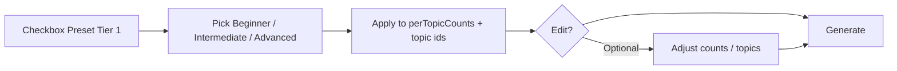

# Tier 1 evaluation presets — implementation plan

## Purpose

Admins can generate a **standard Python Tier 1** assessment from three fixed combos (**Beginner**, **Intermediate**, **Advanced**), then **edit** topic list and MCQ/coding counts before clicking Generate. No new assessment type on the backend—presets only fill the existing generate payload (`per_topic_config`, `topic_names`, `level`, optional timed settings).

## Scope (v1)

- **In scope:** Admin UI on Generate assessment; static preset data in the repo; apply + edit + generate.
- **Out of scope:** DB-stored presets; admin UI to edit JSON in-app; Tier 2 / other languages; pass/fail certification rules.

## Why this is small

The platform already supports:

- Per-topic counts → `per_topic_config` (`AdminPage`, `allocationMode === "per-topic"`).
- `level` → `beginner` | `intermediate` | `advanced` (LLM difficulty).
- Timed assessments → `is_timed`, `duration_minutes`.
- Catalog topics by exact name (seed script).

**v1 is mostly:** one JSON file + a checkbox/cards UI + a function that maps preset → existing React state. **No new API endpoints required.**

Realistic effort: **~2–4 hours** of focused work (not multi-day), assuming catalog is seeded and topic names match.

---

## Preset data file

**Path (suggested):** `frontend/src/data/tier1EvaluationPresets.json`

### Structure (keep it simple)

- One top-level `language_code`: `"py"`.
- Array `presets`; each preset uses **one name** for everything user-facing and for API level:

| Field | Rules |
|-------|--------|
| `name` | Single word, capitalized: `"Beginner"`, `"Intermediate"`, `"Advanced"`. |
| API `level` | Same word, **lowercase**: `"beginner"`, `"intermediate"`, `"advanced"`. |
| `target_duration_minutes` | See table below (from product text, **not** the earlier JSON). |
| `description` | Short goal line for the card (optional but useful in UI). |
| `topics` | Array of `{ "topic_name", "mcq", "coding" }` only — **no `rationale`**. |

**Do not use** separate `key`, `label`, and `level` fields.

Example shape:

```json
{
  "language_code": "py",
  "presets": [
    {
      "name": "Beginner",
      "target_duration_minutes": 60,
      "description": "Rapid verification of fundamental Python syntax.",
      "topics": [
        {
          "topic_name": "Tier 1 - Data Structures & Manipulation (Lists, Sets, Strings)",
          "mcq": 3,
          "coding": 2
        }
      ]
    }
  ]
}
```

### Durations (source of truth — product text)

| Preset | Target duration | Notes |
|--------|-----------------|--------|
| Beginner | **60** min | ~1 hour |
| Intermediate | **90** min | ~90 minutes |
| Advanced | **120** min | ~2 hours |

When a preset is applied, pre-fill **Timed assessment** with `is_timed: true` and `duration_minutes` from this table. Admin may still change minutes before generate.

### Topic names

Must match catalog rows from `scripts/seed_sample_catalog.py` **exactly** (full `"Tier 1 - …"` strings).

### Preset contents (25 questions each: 15 MCQ + 10 coding)

**Beginner** — 60 min

| Topic | MCQ | Coding |
|-------|-----|--------|
| Tier 1 - Data Structures & Manipulation (Lists, Sets, Strings) | 3 | 2 |
| Tier 1 - Logic & Flow Control (Conditionals, Loops, Comprehensions) | 3 | 2 |
| Tier 1 - Functions & Dictionaries (Nested lookups, signatures, defaults) | 3 | 2 |
| Tier 1 - Error Handling (Basic try-except, raising exceptions) | 2 | 1 |
| Tier 1 - Modules, Namespaces & Imports (Absolute/Relative, Circular imports) | 2 | 1 |
| Tier 1 - Basic File I/O & Context Managers (with open statements) | 2 | 2 |

**Intermediate** — 90 min

| Topic | MCQ | Coding |
|-------|-----|--------|
| Tier 1 - OOP Basics (Classes, Methods, Encapsulation) | 3 | 2 |
| Tier 1 - Functions & Dictionaries (Nested lookups, signatures, defaults) | 2 | 2 |
| Tier 1 - Data Structures & Manipulation (Lists, Sets, Strings) | 2 | 2 |
| Tier 1 - Built-in Iterators & Utilities (enumerate, zip, any, all) | 2 | 1 |
| Tier 1 - Basic File I/O & Context Managers (with open statements) | 2 | 1 |
| Tier 1 - Error Handling (Basic try-except, raising exceptions) | 2 | 1 |
| Tier 1 - Testing (unittest, pytest) | 2 | 1 |

**Advanced** — 120 min

| Topic | MCQ | Coding |
|-------|-----|--------|
| Tier 1 - OOP Basics (Classes, Methods, Encapsulation) | 2 | 2 |
| Tier 1 - Generators & Iterables (yield, generator expressions) | 3 | 2 |
| Tier 1 - Testing (unittest, pytest) | 2 | 2 |
| Tier 1 - Built-in Iterators & Utilities (enumerate, zip, any, all) | 2 | 2 |
| Tier 1 - Type Hinting & Annotations (Typing module, static analysis support) | 3 | 1 |
| Tier 1 - Logic & Flow Control (Conditionals, Loops, Comprehensions) | 1 | 1 |
| Tier 1 - Packaging and virtual environments (venv) | 2 | 0 |

Advanced **Packaging** is MCQ-only (coding 0); platform already handles shell editor / no notebook when coding count is 0 on that topic.

---

## Admin UX

1. **Catalog** mode only for presets (disable preset when Custom topic is selected).
2. Checkbox: **Preset Tier 1 evaluation (Python)**.
3. When checked:
   - Lock language to Python (`py`) once catalog languages load.
   - Hide manual topic checklist, auto-distribute, and global MCQ/coding totals (preset drives per-topic mode).
   - Hide separate **Level** dropdown; level comes from selected preset (`name` → lowercase for API).
4. **Three cards** (radio): Beginner | Intermediate | Advanced.
   - Each card shows: description, duration (~60 / ~90 / ~120 min), compact table of MCQ/coding per topic.
5. Selecting a card **applies** preset to state: `selectedTopicIds`, `perTopicCounts`, `allocationMode = "per-topic"`, `level`, timed fields.
6. Button: **Edit question distribution** — expands existing per-topic count UI (add/remove topics from catalog, change counts). **Reset to preset** restores the selected card’s defaults.
7. **Generate** — same `POST /generate-assessment` as today.



---

## Topic resolution

On apply: for each `topic_name` in preset, find catalog topic where `t.name === topic_name`. If any missing → block generate with message to run `python scripts/seed_sample_catalog.py` and list missing names.

Helper: `nameToLevel(name)` → `name.toLowerCase()` for API.

---

## Backend

**None required for v1.** Optional later: `GET /admin/presets` or logging `preset_name` on generate.

---

## Tests

- **Frontend or Node:** `applyPreset(preset, catalogTopics)` returns expected ids and counts; totals 15 MCQ + 10 coding.
- **Python (optional):** assert every `topic_name` in JSON exists in seed sample names list.

---

## Docs

- Short section in `README.md` under Admin / Generate.
- Optional `docs/tier1-presets.md` for stakeholders (what each combo covers, how to edit).

---

## Handoff

See **Task.md** for a checkbox implementation list. JSON file should be created first with full topic rows (no rationale).
