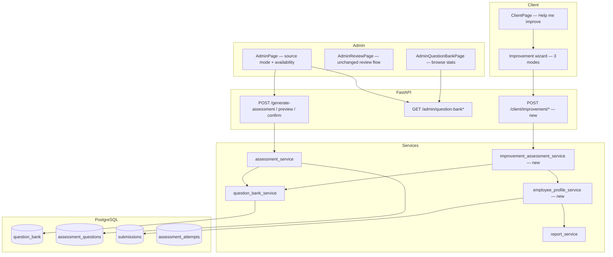

# Question Bank & Personalized Improvement — Implementation Plan

> **Purpose:** Living roadmap for the question-bank, recycling, analytics, and “Help me improve” features.  
> **Companion file:** [task.md](task.md) — checkbox tasks per stage for agentic implementation.  
> **Last reviewed:** 2026-06-15

---

## 1. Product vision

Today, every new assessment triggers fresh LLM generation. We want a **reusable question bank** so admins can choose:


| Mode                         | Who        | Behavior                                                                                                      |
| ---------------------------- | ---------- | ------------------------------------------------------------------------------------------------------------- |
| **Generate new**             | Admin      | LLM creates all questions; each is upserted into the bank; admin reviews before save.                       |
| **Recycle then generate**    | Admin      | Bank first by topic + difficulty; LLM fills shortfall; **admin review** before participants see anything.   |
| **Bank only**                | Client     | “Help me improve” pulls **only** from the bank — **no LLM**, no unreviewed questions. Deliver what is available; if shortage, tell the user. |


Each bank question should expose:

- `times_used` — how many assessments included it
- `percent_correct` / `percent_wrong` — derived from `times_correct` and `times_wrong` after participants submit

Participants already identify with **`employee_id`** (plus name). That ID is the anchor for:

- Excluding **mastered** questions (answered correctly) when building personalized assessments — **not** every question ever seen
- Aggregating performance across assessments
- Future login (out of scope for early stages)

### Employee question eligibility (mastered vs seen)

When selecting bank questions for a participant, **do not exclude questions merely because the employee has seen them before**. Exclude only questions they have **answered correctly** (mastered):

| Type | “Correct” / mastered |
|------|----------------------|
| **MCQ** | Answer matches stored `correct_answer` (case-insensitive), same as submit grading |
| **Coding** (and subjective) | Score **≥ 70 / 100** on that submission |

A participant who got the same coding question wrong three times **may receive it again** — repetition until they learn it is intentional.

**“No more questions”** for a topic + difficulty means: the employee has answered **correctly** every bank question available for that topic and difficulty (nothing left to assign). The UI should say so clearly instead of creating an empty or LLM-filled assessment.

**Implementation:** mastered questions are stored per employee in ``employee_question_mastery`` (``employee_id`` + ``bank_question_id``). Updated on each correct submit; one-time backfill from historical submissions on first deploy.

On **`/client`**, a **“Help me improve”** entry point will offer three guided paths:

1. **Improve my weak areas** — summarize **last 3 assessments only**; build a **bank-only** practice assessment on weakest topics.
2. **Explore new areas** — use **full history** for explored topics; **bank-only** on catalog topics not yet covered.
3. **Improve difficulty** — use **full history**; **bank-only** at stepped difficulty on familiar topics.

**Client rule:** improvement flows never call the LLM. If the bank cannot supply the target count, deliver what is available and explain the gap (e.g. *“You asked for 15 questions; based on availability, there are only 12 valid questions for you in our question bank.”*).

**Profile window rule:** last **3** assessments for weak-area analysis; **all** completed assessments for new-area discovery and difficulty step-up.

---

## 2. Deployment context

This platform runs as a **single FastAPI app + React SPA + PostgreSQL** (see [README.md](README.md)). There is **no separate question-bank server**. All stages below extend the existing backend services and frontend pages — compatible with your current deploy model (API + DB, not a standalone bank microservice).

---

## 3. What is already done (Stage 0 — complete)

The first milestone — **persist questions in the database** — is implemented.

### 3.1 Database


| Artifact                                   | Location                                                                                                      |
| ------------------------------------------ | ------------------------------------------------------------------------------------------------------------- |
| `question_bank` table                      | `services/database.py` (`_ensure_question_bank_table`)                                                        |
| `assessment_questions.bank_question_id` FK | `services/database.py` (`_ensure_assessment_question_bank_columns`)                                           |
| SQLAlchemy models                          | `services/models.py` — `QuestionBank`, `AssessmentQuestion.bank_question_id`, `AssessmentQuestion.difficulty` |


**`question_bank` columns (relevant):** `content_hash` (dedup), `question_text`, `type`, `options`, `correct_answer`, `code_snippet`, `topic_name`, `language_code`, `difficulty`, `times_used`, `times_correct`, `times_wrong`, `created_at`.

### 3.2 Services


| Capability                      | Location                                                                               | Wired?                            |
| ------------------------------- | -------------------------------------------------------------------------------------- | --------------------------------- |
| Upsert on generate/confirm      | `question_bank_service.add_questions_to_bank` via `assessment_service._upsert_to_bank` | ✅                                 |
| Link assessment rows → bank     | `question_bank_service.link_assessment_questions_to_bank`                              | ✅                                 |
| Record correct/wrong on submit  | `question_bank_service.record_question_outcome` in `submit_assessment`                 | ✅                                 |
| Browse bank + % stats           | `question_bank_service.get_bank_stats`                                                 | ✅ API only                        |
| Availability check              | `question_bank_service.get_bank_availability`                                          | ✅ API only                        |
| Find reusable questions         | `question_bank_service.find_bank_questions`                                            | ⚠️ **Implemented but not called** |
| Employee mastered-question exclusion | `employee_question_mastery` table + `get_employee_mastered_bank_ids` | ✅ Stage 1 |


### 3.3 API (admin)


| Endpoint                                | Purpose                                                           |
| --------------------------------------- | ----------------------------------------------------------------- |
| `GET /admin/question-bank`              | List bank rows with filters + `percent_correct` / `percent_wrong` |
| `GET /admin/question-bank/availability` | Per-topic availability + shortage vs `n_requested`                |


### 3.4 Participant / employee foundation


| Capability                          | Location                                                                |
| ----------------------------------- | ----------------------------------------------------------------------- |
| `employee_id` on load/submit        | `app.py`, `schemas/assessment.py`, `ClientPage.jsx`                     |
| Per-employee shuffle                | `shuffle_service.py`                                                    |
| Per-assessment topic summary report | `report_service.aggregate_topic_summary`, `GET /assessment/{id}/report` |
| Timed attempts keyed by employee    | `AssessmentAttempt`, `attempt_service.py`                               |


### 3.5 Not done yet (everything after Stage 0)

- Admin UI: question source toggle, availability preview, bank browser
- Generation pipeline: actually **using** `find_bank_questions` / hybrid fill
- Client UI: “Help me improve” and the three improvement flows
- Cross-assessment employee analytics (mode-specific: last 3 vs full history)
- Dedicated tests for question bank service
- Admin UI for bank stats

### 3.6 Difficulty labels (fixed in Stage 1)

Bank and `assessment_questions.difficulty` store admin **`level`** values: `beginner` | `intermediate` | `advanced`. Legacy `easy`/`medium`/`hard` rows are backfilled on startup via `_backfill_question_bank_difficulty_labels` in `database.py`.

---

## 4. Architecture (target state)




**Design principles**

1. **One bank, many assessments** — dedup by content hash; stats updated on every graded submission.
2. **Admin: bank-first, LLM-second** — recycle-then-generate fills shortage only on the **admin** path, always followed by review.
3. **Client: bank-only** — “Help me improve” never surfaces LLM-generated questions; partial counts are OK with clear messaging.
4. **Mastered-only exclusion** — skip bank questions the employee already got **correct**; wrong answers can repeat until mastered.
5. **Reuse admin review flow** — any LLM-generated item goes through preview/confirm before participants see it.
6. **Stages are independent** — each stage in [task.md](task.md) can be handed to an agent with minimal cross-stage context.

---

## 5. Stages (modular roadmap)

### Stage 0 — Question persistence ✅ DONE

Save every generated/confirmed question into `question_bank`; link `assessment_questions`; increment stats on submit.

**Exit criteria:** Met (see §3). Optional: add `tests/test_question_bank_service.py` in Stage 1.

---

### Stage 1 — Data correctness & stats hardening

**Goal:** Bank rows are queryable by admin `level`; stats are trustworthy.

**Work:**

1. **Normalize difficulty in the bank** — store `beginner` | `intermediate` | `advanced` (not `easy`/`medium`/`hard`). Migration/backfill for existing rows.
2. **Align `link_assessment_questions_to_bank`** — `AssessmentQuestion.difficulty` should match bank.
3. **Unit tests** — upsert dedup, outcome counters, `get_employee_mastered_bank_ids`, availability math.
4. **Refactor employee exclusion** — rename/replace `get_employee_seen_bank_ids` → `get_employee_mastered_bank_ids`: only bank IDs where the employee’s **best or latest** submission was correct (MCQ match; coding/subjective score ≥ 70). Update `find_bank_questions` and `get_bank_availability` to use mastered exclusion by default.
5. **Optional:** index or materialized view if bank grows large (not required for v1).

**Files:** `assessment_service.py`, `question_bank_service.py`, `database.py`, `tests/test_question_bank_service.py`.

**Agent handoff:** “Fix difficulty normalization and add bank unit tests. Do not change generation behavior yet.”

---

### Stage 2 — Admin: question source mode + hybrid generation

**Goal:** Admin chooses **Generate new** vs **Recycle then generate** when creating an assessment.

There is **no “recycle only” mode** in v1 — you can never assume the bank has enough questions. “Recycle” always means **bank first, LLM for the remainder**, whether the admin uses a Tier 1 preset or picks custom topics and counts manually.

**API changes (`GenerateAssessmentBody` / preview / confirm):**

```text
question_source: "generate_new" | "recycle_then_generate"   # default: generate_new
target_employee_id: str | null   # optional; exclude bank questions this employee has already mastered
```

**Backend (`assessment_service`):**

1. When `question_source == "recycle_then_generate"`, for each topic + type + count in `per_topic_config` (or global counts):
   - Call `find_bank_questions` for that slice.
   - If shortage > 0 → generate only the shortage for that topic/type (always — no error for shortfall).
2. Mark recycled rows with existing `bank_question_id` when saving.
3. Response metadata:

```json
{
  "bank_sourced_count": 12,
  "llm_generated_count": 13,
  "shortage_messages": [
    "Tier 1 - OOP Basics: only 2 MCQ available; generating 1 new"
  ]
}
```

**Admin UI (`AdminPage.jsx`):**

- Toggle or radio: **Generate new** | **Recycle then generate** (two options only).
- When recycle-then-generate is on: call `GET /admin/question-bank/availability` with selected topics, level, total count → show message: *“Only X questions available; we will generate Y new.”*
- Pass `question_source` through preview → review → confirm.
- Works with **Tier 1 presets** and **manual topic/count selection** — the system must satisfy the full requested distribution (per-topic MCQ/coding counts) by combining bank pulls and LLM generation.

**Exit criteria:** Admin can build a 25-question Tier 1 assessment using ≥1 bank question; shortage filled by LLM; message shown in UI. Same behavior when the admin skips presets and manually selects topics + counts — demand is always fully met via bank + new questions.

**Agent handoff:** “Implement question_source in schemas, assessment_service hybrid builder, AdminPage toggle + availability banner. Depends on Stage 1 difficulty fix.”

---

### Stage 3 — Admin: question bank browser

**Goal:** Admins inspect bank health — which questions are hard/tricky (high `percent_wrong`).

**UI:** New page `AdminQuestionBankPage.jsx` (nav link from admin menu).


| Column              | Source                    |
| ------------------- | ------------------------- |
| Topic               | `topic_name`              |
| Difficulty          | `difficulty`              |
| Type                | `type`                    |
| Times used          | `times_used`              |
| % correct / % wrong | computed                  |
| Question preview    | truncated `question_text` |


**Filters:** language, topic, difficulty, type; sort by `percent_wrong` desc (find tricky questions).

**API:** Reuse `GET /admin/question-bank` (no new endpoint required).

**Exit criteria:** Admin can filter Python beginner MCQ and sort by failure rate.

**Agent handoff:** “Frontend-only stage; wire existing admin question-bank API.”

---

### Stage 4 — Employee performance profile (cross-assessment)

**Goal:** Backend service that powers all three “Help me improve” modes, with **different history windows per mode**.

**New service:** `services/employee_profile_service.py`

**Inputs:** `employee_id`, optional `language_code`, `scope: "last_3" | "full_history"`

| Scope | Used by | Meaning |
|-------|---------|---------|
| `last_3` | Weak areas | Only the **last 3 distinct submitted assessments** (by timestamp) |
| `full_history` | New areas, Improve difficulty | **All** completed assessments for this employee |

**Outputs (shape varies slightly by scope):**

```json
{
  "employee_id": "E1001",
  "scope": "last_3",
  "assessments_analyzed": 3,
  "language_code": "py",
  "topic_performance": [
    {
      "topic_name": "Tier 1 - OOP Basics",
      "questions_count": 5,
      "average_percent": 62.0,
      "attempts": 2,
      "last_difficulty": "beginner"
    }
  ],
  "explored_topic_names": ["..."],
  "unexplored_topic_names": ["..."],
  "weakest_topics": ["..."],
  "recommended_difficulty_by_topic": { "Tier 1 - OOP Basics": "intermediate" }
}
```

**Logic sketch:**

1. List submissions for employee (reuse `attempt_service.normalize_employee_id`, submission joins).
2. **Weak areas (`scope=last_3`):** take last 3 distinct assessments → merge topic summaries → `weakest_topics` from lowest `average_percent` (e.g. < 70%).
3. **New areas (`scope=full_history`):** `explored_topic_names` from **all** assessments; `unexplored_topic_names` = catalog topics for `language_code` minus explored.
4. **Improve difficulty (`scope=full_history`):** merge topic performance across **all** assessments; `recommended_difficulty_by_topic` — if last difficulty was `beginner` and avg ≥ 75% → `intermediate`; if `intermediate` and avg ≥ 80% → `advanced`; else stay per product rules.
5. Reuse `report_service.aggregate_topic_summary` (or shared helper) per assessment before merging.

**API:**

- `GET /client/employee-profile?employee_id=&language_code=&scope=last_3|full_history` (client JWT), or
- Each improvement endpoint calls the service with the correct scope internally (preferred — UI does not need to choose).

**Exit criteria:** Weak-areas profile uses 3 assessments only; new-areas and difficulty profiles reflect entire history (e.g. topic explored in assessment #1 still counts as explored even if not in last 3).

**Agent handoff:** “New employee_profile_service + one read endpoint; no UI yet.”

---

### Stage 5 — Client: “Help me improve” shell + weak areas

**Goal:** Button on `/client` → wizard step 1 → **Improve my weak areas**.

**UI (`ClientPage.jsx` or `ImprovementPage.jsx`):**

1. Require `employee_id` (already on page).
2. Button **Help me improve** → modal or sub-route `/client/improve`.
3. Option A: **Improve my weak areas** — show merged topic table for last 3 assessments; highlight weak topics; **Start practice assessment** button.

**Backend (`improvement_assessment_service.py`):**

- `POST /client/improvement/weak-areas`
- Body: `employee_id`, `language_code`, optional `questions_requested` (target count)
- Profile `scope=last_3` → `weakest_topics` → `per_topic_config`
- **`question_source = bank_only`** — call `find_bank_questions` only; **never** call LLM
- `exclude_employee_id` → exclude **mastered** bank IDs only
- Response includes `questions_requested`, `questions_delivered`, `availability_message` when `delivered < requested`
- If `questions_delivered == 0` → do not create assessment; return friendly message (e.g. mastered everything available for those topics, or bank empty)
- If `questions_delivered > 0` → auto-create shared assessment and redirect to take it

**Product decision (v1):** Participants **never** receive LLM-generated questions without admin review. Improvement assessments are **bank-only**. Shortfall is communicated, not silently filled:

> You asked for **{requested}** questions, but based on availability there are only **{delivered}** valid questions for you in our question bank.

**Exit criteria:** Employee clicks weak areas → receives up to available bank questions on weak topics; if bank has fewer than target, message explains the gap; if all relevant questions are mastered, clear “nothing left” state.

**Agent handoff:** “Client UI + improvement weak-areas endpoint; depends on Stage 1 (mastered exclusion) + 4. Does **not** use admin LLM hybrid.”

---

### Stage 6 — Client: explore new areas

**Goal:** Second wizard option — topics user hasn’t tried; **bank-only**.

**Backend:** `POST /client/improvement/new-areas`

- Profile `scope=full_history` → `unexplored_topic_names`; pick top K (e.g. 3–5).
- **`question_source = bank_only`** — no LLM
- Exclude employee’s **mastered** bank IDs
- Same `questions_requested` / `questions_delivered` / availability messaging as Stage 5

**UI:** Show which new topics were selected and why; show shortage message if applicable.

**Exit criteria:** User gets bank-only assessment on unseen topics, or clear message if bank cannot supply questions.

**Agent handoff:** “Depends on Stage 4–5 patterns; one new endpoint + wizard branch.”

---

### Stage 7 — Client: improve difficulty

**Goal:** Third wizard option — same topics, harder difficulty; **bank-only**.

**Backend:** `POST /client/improvement/difficulty`

- Profile `scope=full_history` → `recommended_difficulty_by_topic` per explored topic.
- **`question_source = bank_only`** at the stepped difficulty — no LLM
- Exclude **mastered** questions at that difficulty
- If user has **mastered all** bank questions at the next difficulty for a topic → message: nothing left at this level (or suggest admin-generated content later)

**Exit criteria:** Beginner-only user receives intermediate/advanced **bank** questions where available; shortage and “all mastered” states messaged clearly.

**Agent handoff:** “Depends on Stage 1 + 4 + 5 patterns; one endpoint + wizard branch.”

---

### Stage 8 — Future (out of scope for initial tasks)


| Item                                       | Notes                                                              |
| ------------------------------------------ | ------------------------------------------------------------------ |
| Employee login                             | `employee_id` today is self-declared; later tie to SSO/users table |
| Question retirement                        | Admin retires high-wrong or low-discrimination items               |
| Seeding bank from `seed_sample_catalog.py` | Bulk import script for demo environments                           |
| ARCHITECTURE.md update                     | Still describes CSV; should reflect PostgreSQL + bank              |


---

## 6. Per-topic selection algorithms

### Admin — recycle then generate (Stage 2)

For catalog mode with `per_topic_config`:

```text
for each topic T:
  for each type in {mcq, coding, subjective}:
    needed = per_topic_config[T][type]
    found, shortage = find_bank_questions([T], level, needed,
      exclude_employee_id=..., exclude_mastered_only=true)
    append found to rows
    if shortage > 0 and question_source == "recycle_then_generate":
      generate shortage via LLM → admin review → confirm
```

### Client — bank only (Stages 5–7)

```text
for each topic T in selected topics:
  for each type with needed count:
    found, shortage = find_bank_questions(..., exclude_mastered_only=true)
    append found to rows
    # shortage > 0: do NOT generate — record for availability_message
deliver len(rows) questions; if len(rows) < questions_requested, show message
if len(rows) == 0: no assessment created — explain why
```

**Ordering:** Interleave or group by topic to match current assessment UX (keep topic blocks consistent with today).

**Deduplication:** Within one assessment, never attach the same `bank_question_id` twice.

---

## 7. Messaging copy (admin + client)

**Admin shortage (recycle then generate):**

> Only **{available}** questions available for the selected topics at **{level}** level. We will generate **{shortage}** new questions.

**Per-topic variant:**

> **{topic_name}:** {available} available, generating {shortage} new.

**Client improvement — shortage:**

> You asked for **{requested}** questions, but based on availability there are only **{delivered}** valid questions for you in our question bank.

**Client improvement — all mastered:**

> You have already answered all available questions correctly for **{topic}** at **{level}** level. Great work — check back later or try another improvement path.

**Client weak areas:**

> Based on your last 3 assessments, we recommend extra practice on: **{topic list}**.

**Client new areas / difficulty:**

> Based on your full assessment history, …

---

## 8. Testing strategy


| Stage | Tests                                                                     |
| ----- | ------------------------------------------------------------------------- |
| 1     | `tests/test_question_bank_service.py` — unit                              |
| 2     | `tests/test_assessment_recycle.py` — hybrid generation, shortage metadata |
| 4     | `tests/test_employee_profile_service.py` — rollup, unexplored topics      |
| 5–7   | API integration tests + manual QA on `/client`                            |


---

## 9. Related docs


| File                                                           | Topic                                         |
| -------------------------------------------------------------- | --------------------------------------------- |
| [task.md](task.md)                                             | Checkbox tasks per stage                      |
| [README.md](README.md)                                         | Runbook, API table                            |
| [docs/assessment-generation.md](docs/assessment-generation.md) | Per-topic allocation                          |
| [docs/tier1-presets.md](docs/tier1-presets.md)                 | Preset combos (good test fixture for recycle) |
| [Plan.md](Plan.md) / [Task.md](Task.md)                        | Separate Tier 1 preset feature (complete)     |


---

## 10. Suggested agent execution order

```text
Stage 0 ✅ → Stage 1 → Stage 2 → Stage 3 (parallel ok after 1)
                              ↘
Stage 4 → Stage 5 → Stage 6 → Stage 7
```

Stages **3** (admin bank UI) and **4** (employee profile) can run in parallel after Stage 1. Stages **5–7** depend on Stage **1** + **4** (not Stage 2 — client flows are bank-only).